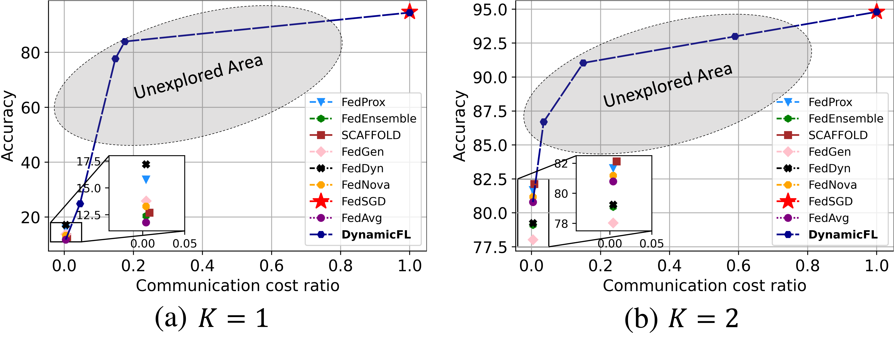

# DynamicFL: Dynamic Federated Learning with Communication Resource Allocation

[IEEE Big Data 2024] This is an implementation of [DynamicFL: Dynamic Federated Learning with Communication Resource Allocation](https://arxiv.org/abs/2409.04986)



## Requirements

- Requires Python 3.9

- see requirements.txt
  

## Instruction

- Global hyperparameters are configured in config.yml

- Hyperparameters can be found at process_command.py in utils.py

  

## Examples

- Train CIFAR10 dataset with CNN, 0.1 active rate, 100 clients, K=1, DynamicAvg, Dynamic-0.3, 'a-g' interval

  ```ruby
  python train_classifier_fl.py --control_name CIFAR10_cnn_0.1_100_non-iid-l-1_dynamicfl_5_0.3-0.7_1-0_6-1
  ```

- Train CIFAR100 dataset with ResNet-18, 0.1 active rate, 100 clients, Dir(0.3), DynamicAvg, Fix-0.3, 'b-f' interval

  ```ruby
  python train_classifier_fl.py --control_name CIFAR100_resnet18_0.1_100_non-iid-d-0.3_dynamicfl_5_1-0_0.3-0.7_5-2
  ```

  


